<h1 align="center">
  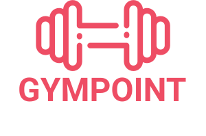
</h1>

<h3 align="center">
  GoStack Bootcamp's main challenge
</h3>

## About the project

Gympoint is a gym management application, developed using Node.js/ExpressJS for the back-end,
ReactJS for the front-end, and React Native for the mobile app. <br />
The web application is made for the gym administrator, which can create,
view, edit and delete students, plans and registrations (enrollments). Also, it can reply help orders from the students. <br />
The mobile app is made for the students, which can add a check-in (each student has 5 check-ins in an interval of 7 consecutive days), create and view help orders.
<br /><br />
This challenge is required for the certification of Rocketseat's bootcamp.

## Demonstration

Watch the video.
[](https://youtu.be/1nGY44rnRvw)

## Setup

Make sure you have installed Git, Node.js (LTS version), Yarn and Docker (optional). <br />
<br/><br/>
The databases used are PostgreSQL and Redis, which you can use Docker containers for install them.
<br/>

```
docker run --name gympointdb -e POSTGRES_PASSWORD=docker -p 5432:5432 -d postgres:11
docker run --name redisgympoint -p 6379:6379 -d -t redis:alpine
```

After installing, use this command to start the containers:

```
docker start redisgympoint && docker start gympointdb
```

<br />
The application alse has a mail management system using <a href="https://mailtrap.io/">MailTrap</a> and an error monitoring system using <a href="https://sentry.io/welcome/">Sentry</a>. You can create an account for both sites.
<br />

Then, clone this repository:

```
git clone https://github.com/gmcotta/gympoint.git
```

<br />

### Back-end instructions

On the root folder, access the back-end folder and install the dependencies:

```
cd gympoint/backend
yarn
```

Access the `.env.example` file and fill the environment variable values according to your system, and save the file as `.env`. Also, make sure you have created a PostgreSQL database with the same name as `DB_NAME` variable.

Then, do the database migrations:

```
yarn sequelize db:migrate
yarn sequelize db:seed:all
```

Finally, you can run the application and mail servers:

```
yarn dev
# open another terminal to run the code below
yarn queue
```

If you want to do some request tests, you can use Insomnia and import the file `Insomnia_requests.json`

<br />

### Front-end instructions

On the root folder, access the front-end folder and install the dependencies:

```
cd gympoint/frontend
yarn
```

Run the application:

```
yarn start
```

On Login page, use admin@gympoint.com as user and 123456 as password.

<br />

### Mobile instructions

On the root folder, access the mobile folder and install the dependencies:

```
cd gympoint/mobile
yarn
```

To run on iOS, you need to access the iOS folder and install the CocoaPods dependencies:

```
cd ios && pod install
```

Then, return to the previous folder and run the app:

```
cd ..
react-native run-ios
```

To run on Android, make sure you have an emulator opened. If you are using Genymotion, you need to access api.js on the service folder and change the ip address `http://10.0.2.2:3333` to `http://10.0.3.2:3333`

Then, run the app:

```
react-native run-android
```

## Images

### Web

<p float="left">
  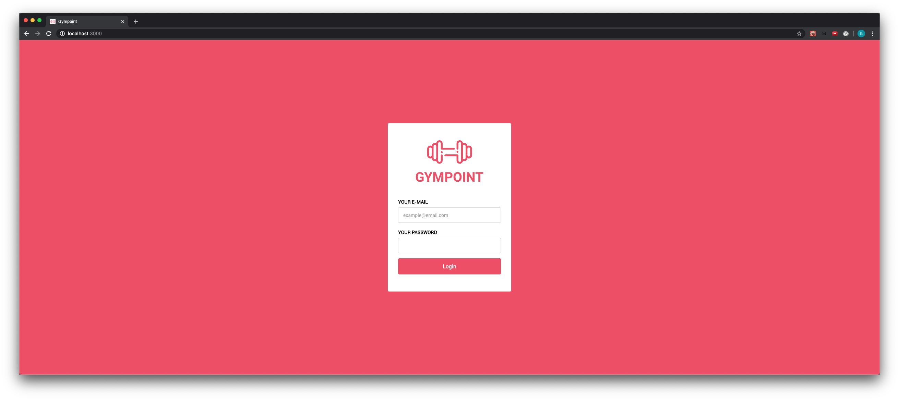
  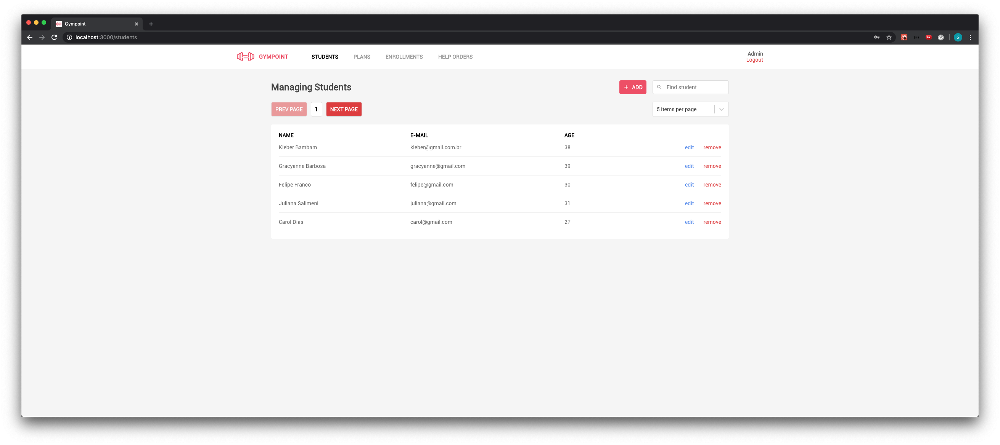
  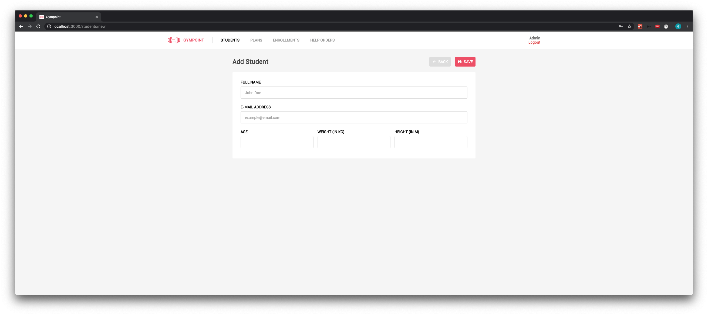
  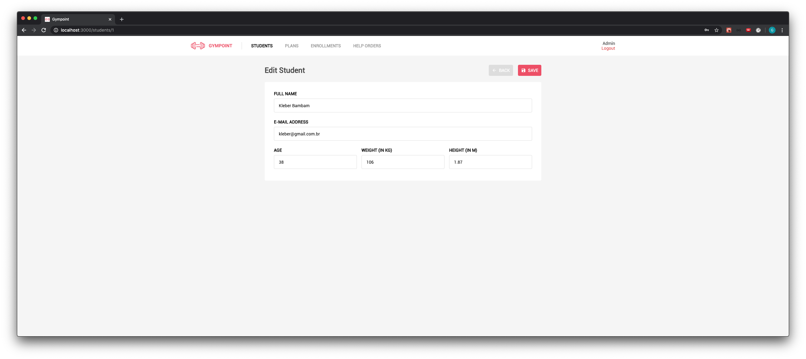
  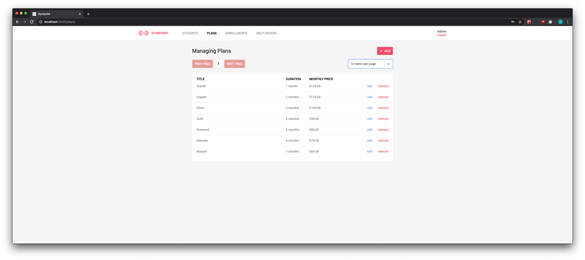
  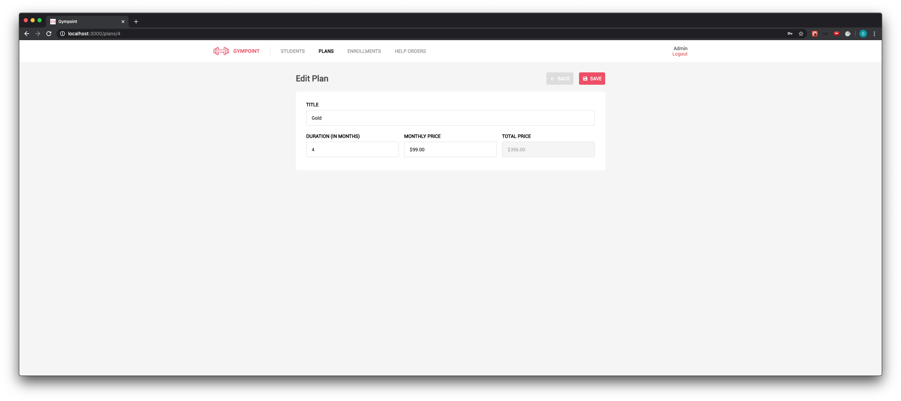
  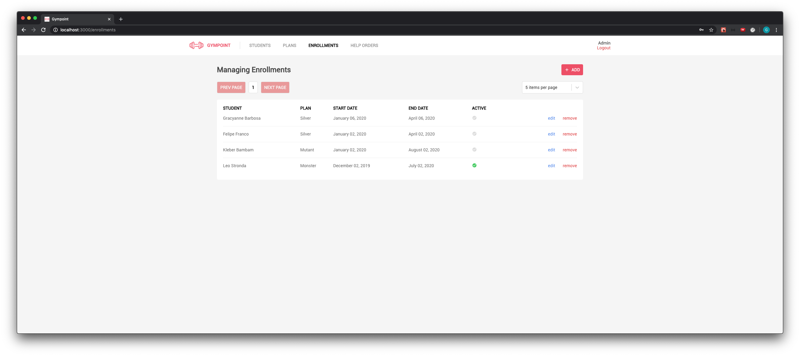
  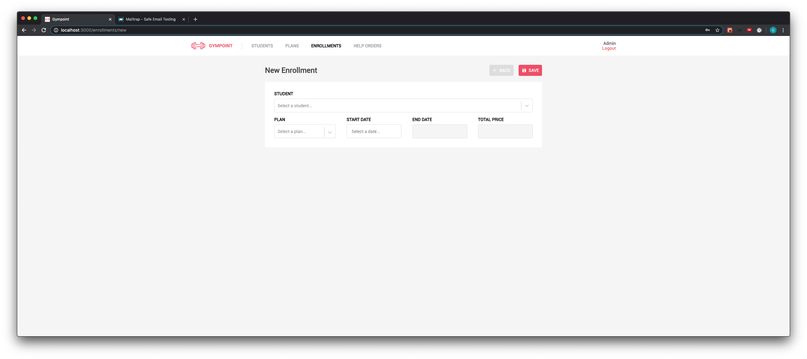
  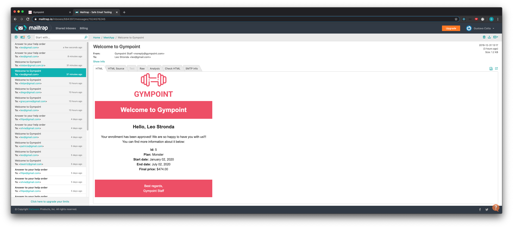
  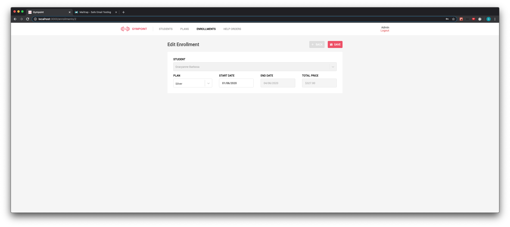
  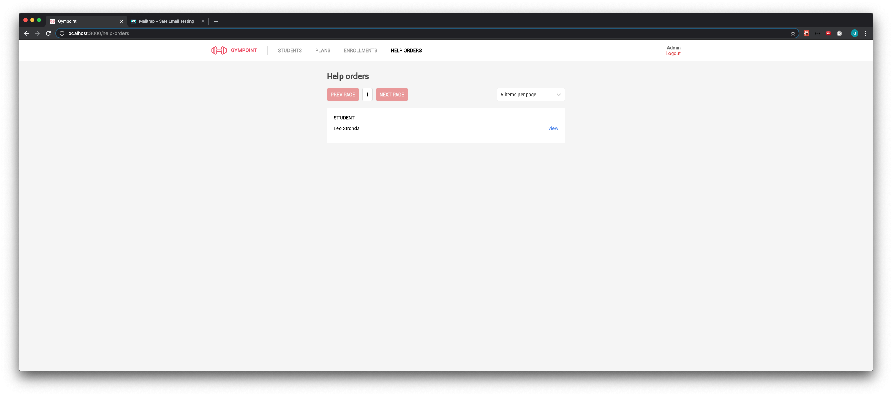
  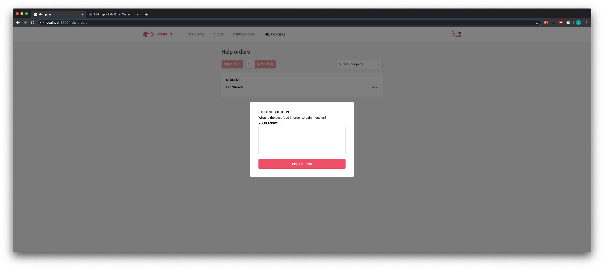
</p>

### Mobile

<p float="left">
  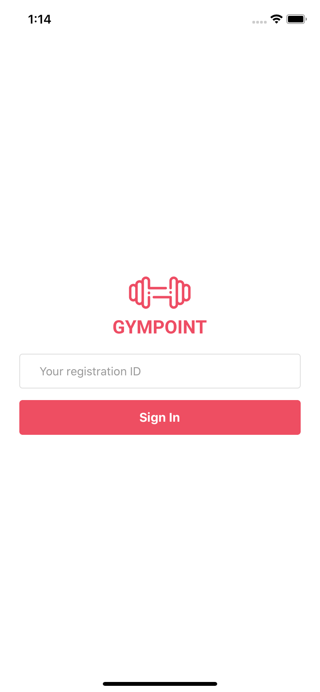
  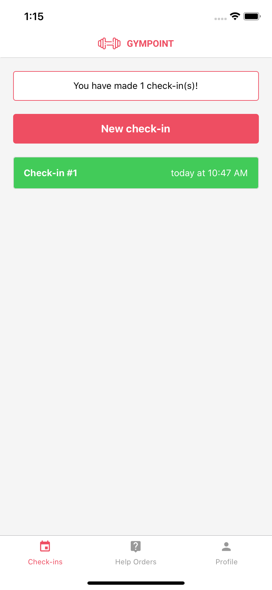
  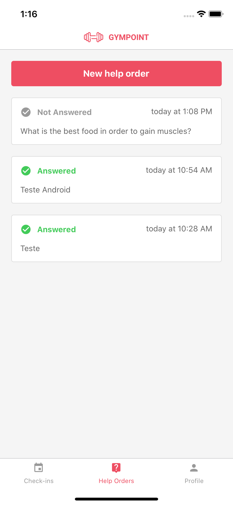
  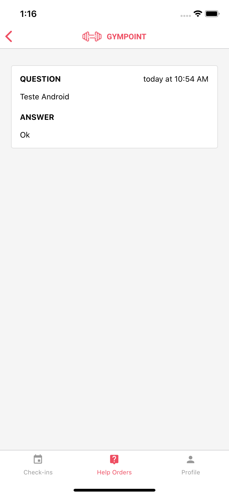
  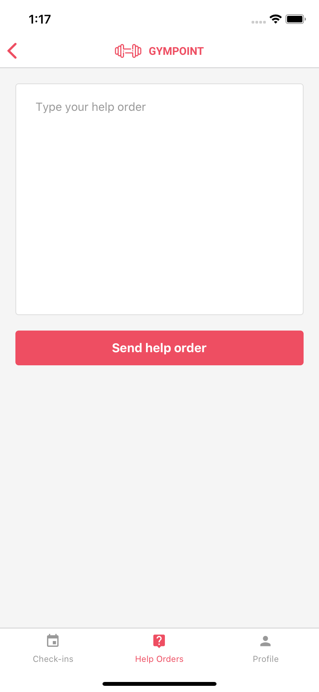
  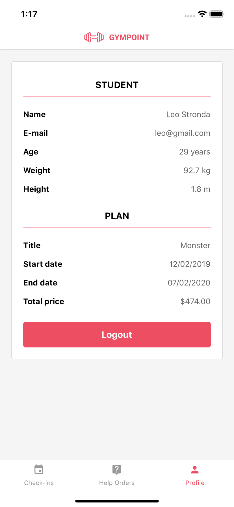
</p>

### More Information

You can access the following repositories for more details about the development.

- Back-end: https://github.com/gmcotta/gympoint-backend
- Front-end: https://github.com/gmcotta/gympoint-frontend
- Mobile: https://github.com/gmcotta/gympoint-mobile

Also, it will be very appreciated if someone could help me to merge these repositories into this one :)
